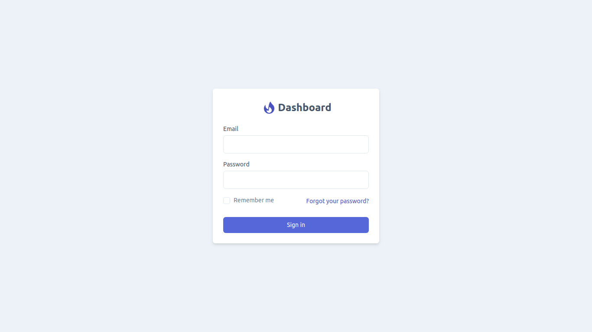
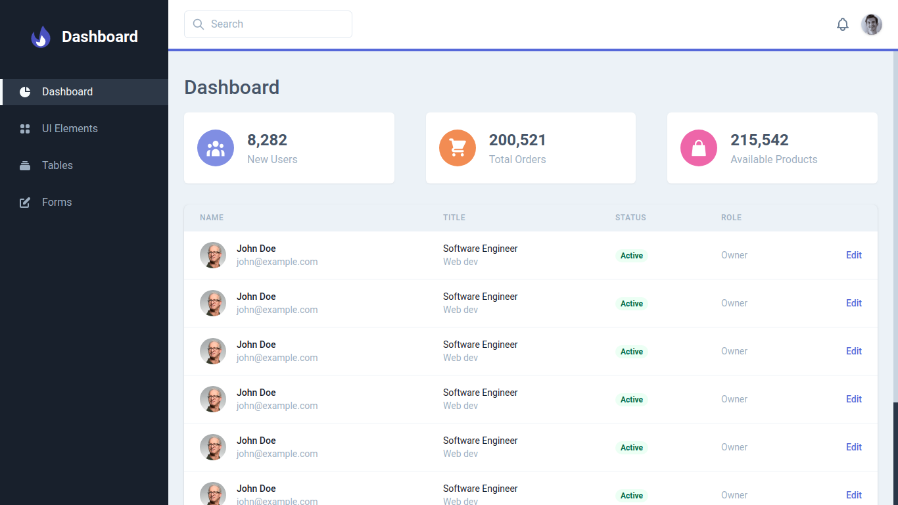
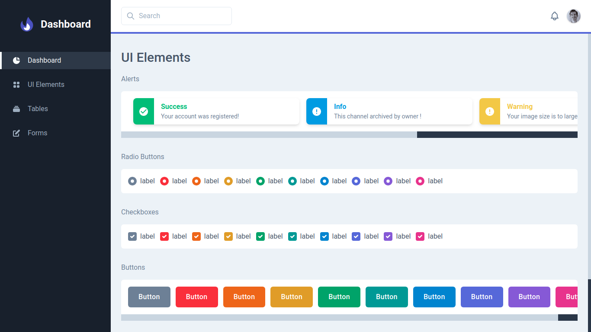
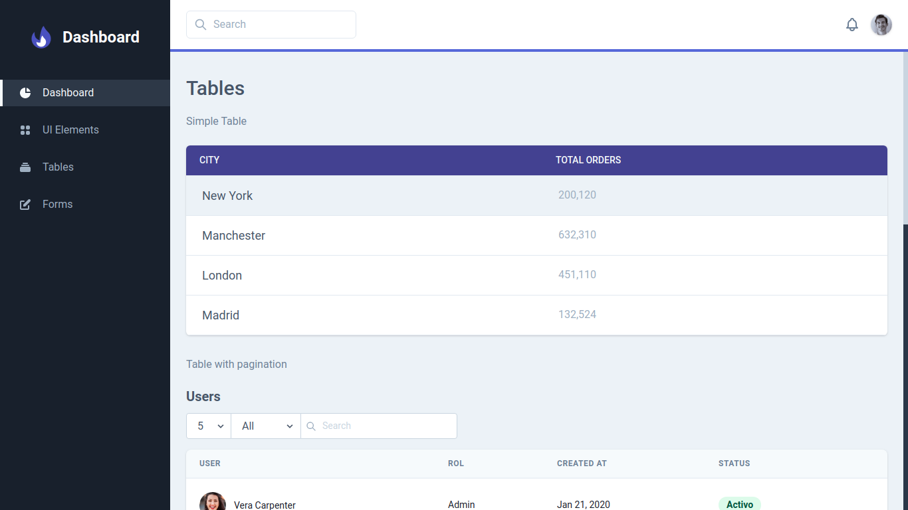

# Dashboard Template

<a href="https://github.com/tailwindcomponents/dashboard-template/blob/master/LICENSE.md">
    
</a>
<a href="https://github.com/tailwindcomponents/dashboard-template/stargazers">
    
</a>
<a href="https://twitter.com/TwComponents">
    
</a>

🧶 Start template for dashboard projects build with Tailwindcss, Alpinejs and Laravel blade.

Live [Demo](https://dashboard-tailwindcomponents.netlify.app/) 

## Resources
- [Jigsaw](https://jigsaw.tighten.co)
- [Tailwindcss](https://tailwindcss.com)
- [AlpineJS](https://github.com/alpinejs/alpine)
- [Heroicons](https://heroicons.dev)

## Screenshots

Login



Dashboard



UI Elements



Tables



Forms


## Project setup
```
composer install && npm install
```

### Compiles and hot-reloads for development
```
npm run watch
```

### Compiles and minifies for production
```
npm run production
```
